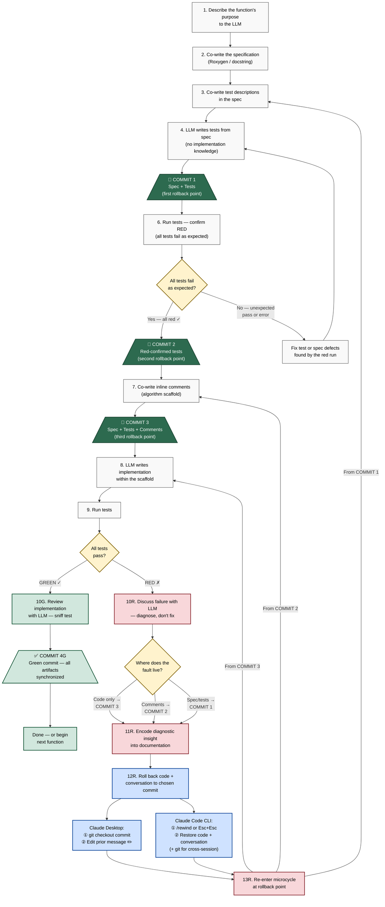

# The Hybrid Workflow

*A documentation-driven, test-verified workflow for LLM-collaborative
coding — combining DocDD's rollback discipline with contract-first
specification and red-green testing.*

---

## Who This Is For

You write code with an LLM — in Claude Desktop connected to RStudio
via MCP, or in Claude Code at the command line. You want reliable,
tested functions but you're not sure how to structure the back-and-forth
between you and the LLM so that mistakes don't snowball.

This document lays out a step-by-step workflow for writing one function
from scratch, using the LLM as a collaborator. It covers:

- How to co-design a specification and tests with the LLM
- When and why to commit to git
- How to roll back both your code *and* the LLM's memory when
  something goes wrong
- The exact keystrokes for doing that in Claude Desktop vs Claude
  Code CLI

Every numbered step below corresponds to a node on the workflow
diagram. The colored boxes are **commit-rollback windows** — safe
checkpoints where the artifacts are self-contained and any LLM can
pick up the work cold.

---

## When to Use This Workflow (and When Not To)

This workflow is **Gear 3** — contract-first development. It assumes
you already know what to build. That knowledge doesn't appear from
nowhere. It comes from two earlier modes of working:

**Gear 1 — Exploration.** You have data and a question. You're
plotting, reshaping, checking patterns, testing ideas. Code is rough
and disposable. The LLM helps you get scripts running. No contracts,
no tests, no package structure. You work in a scratch directory
(`exploration/`) and the only rule is curiosity.

**Gear 2 — Collaborative Design.** You have a functional goal but not
a complete specification. Through dialogue, the LLM asks clarifying
questions, proposes structure, surfaces edge cases, and builds working
prototypes. Design decisions are recorded as they happen. You work in
a design directory (`design/`) with informal contracts and working
prototypes.

**Gear 3 — This workflow.** You can articulate what each function
does, what it takes, what it returns, and what domain rules it
encodes. Now you write the contract, derive the tests, and implement.
This is the workflow described below.

**Don't force Gear 3 on Gear 1 problems.** If you're still figuring
out whether the data has a signal, writing Roxygen blocks is premature
discipline. Explore first. When a pattern, calculation, or workflow
stabilises and you start caring about correctness across cases —
that's when you shift up.

**The gears cycle.** Building a tested function in Gear 3 often
produces output that raises new questions, sending you right back to
Gear 1. That's not a failure of the process — it's how applied
science works. A return to exploration is not starting over. It's a
deepening.

---

## Key Concepts (for the total beginner)

**Spec / specification:** A structured description of what a function
does, what it accepts, what it returns, and what rules it enforces.
In R, this is a Roxygen block (the `#'` comments above a function).
In Python, it's a docstring.

**Red / green:** Testing terminology. "Red" means the tests fail.
"Green" means they pass. A test that fails before code exists is
*good* — it proves the test can detect wrongness.

**Commit:** A snapshot saved in git (a version control tool). You can
always return to any commit. Think of it as a save point in a video
game.

**Rollback:** Returning to a previous commit. The code goes back to
how it was at that save point.

**Context / context window:** What the LLM can "see" in the current
conversation. Everything you and the LLM have said, plus any files
loaded. When the LLM sees a failed attempt, it reasons about that
failure — sometimes helpfully, sometimes not. "Context hygiene" means
keeping the context clean of confusing or misleading history.

**Liminal window:** The space between a commit and a rollback. This
is where you can have a design conversation, improve documentation,
and then erase the failed attempt from context while keeping the
improved docs. The learning survives; the confusion doesn't.

**MCP (Model Context Protocol):** A bridge that lets the LLM interact
with your tools (like RStudio). When Claude Desktop is connected to
RStudio via MCP, Claude can run R code in your session.

---

## The Workflow Diagram



---

## Annotations

### 1. Describe the function's purpose to the LLM

Tell the LLM what this function needs to do, in plain language. What
problem does it solve? Where does it sit in the larger workflow? What
domain knowledge does it depend on?

This is a conversation, not a dictation. The LLM should ask
clarifying questions. You should push back if it misunderstands your
domain. You are the subject matter expert. The LLM brings breadth
(knowledge of tools, patterns, techniques); you bring depth (knowledge
of what this function actually needs to do in the real world).

### 2. Co-write the specification (Roxygen / docstring)

The LLM drafts the formal documentation block from your discussion.
In R, this is a Roxygen block — the `#'` comments above a function.
In Python, it's a docstring. The spec should include:

- **Function signature** — name, arguments, defaults
- **Parameter descriptions** (`@param` in R) — what each input means
  *in the domain*, with constraints ("must be positive," "character
  vector of column names")
- **Return value** (`@return` in R) — what comes back, with structure
  ("a tibble with columns `water_year` and `mean_discharge_cms`")
- **Details** (`@details`) — key decisions, assumptions, algorithm
  choice
- **Side effects** — database writes, file creation, or `None`
- **Errors / Raises** — what conditions produce errors

Review and refine through dialogue. If a constraint is vague, tighten
it. If a return description is ambiguous, make it concrete. The spec
must be precise enough that someone who has never seen the code can
derive what the function does.

### 3. Co-write test descriptions in the spec

Still in discussion — no code yet. The LLM proposes test cases as
plain-language descriptions using the **Case / Expect pattern**:

```
Tests:
    Negative K_s value
        Expect error (parameter must be positive)
    Single valid observation
        Expect tibble with one row, correct water year
    Dates spanning October boundary
        Expect both dates assigned to same water year
```

Two categories emerge naturally:

- **"Guard the gates" tests** — invalid input should produce an
  error. Derived from parameter constraints in the spec.
- **"Did it do the right thing" tests** — valid input should produce
  correct output. Derived from the function's purpose and your domain
  knowledge of what the right answer is.

Your job is to know which edge cases matter in your domain and which
are missing. If you can't describe what a test should expect, the
spec is underspecified — fix the spec, then the test description.

**Optional — agentic inter-rater testing:** Instead of (or in
addition to) interactive discussion, you can run the test-derivation
step multiple times in independent, clean LLM sessions — all working
from the same spec — and compare the outputs. Tests that appear in
every run are high-confidence. Tests unique to one run suggest
ambiguity in the spec. Contract clauses that no run tests are the
danger zone. Three runs is the minimum for majority-vote signal. This
is a heavier-weight alternative that catches mismatches when tests
are designed solely by LLMs without interactive human review.

### 4. LLM writes tests from spec (no implementation knowledge)

The LLM translates the test descriptions into executable test code
(`testthat` expectations in R, `pytest` assertions in Python).

**Critical rule:** the LLM works only from the specification. There
is no implementation yet. This is what prevents tests from becoming
a self-fulfilling prophecy of whatever the code happens to do.

Review the test code in discussion. If a test doesn't faithfully
reflect the spec, fix it. If reviewing reveals the spec was
incomplete, go back and fix the spec first (step 3), then let the
test follow.

**Why this is safe in the same session:** The concern about "no
implementation knowledge" means the LLM must not have seen an
implementation. At this point, no implementation exists. The
sequencing provides the isolation. A fresh session is not needed here
— it's needed later, at the rollback points, when a failed
implementation has entered context.

### 🔲 COMMIT 1 — Spec + Tests *(first rollback point)*

**What to commit:** The specification (Roxygen block or docstring)
and the test file.

**Git command:** `git add R/my_function.R tests/testthat/test-my_function.R && git commit -m "spec and tests for my_function"`

**Why this matters:** This is your most conservative rollback point.
Everything downstream — the red run, the inline comments, the
implementation — can be erased and you return here with a clean spec
and clean tests.

**🪟 Liminal window.** The artifacts at this commit are
self-contained. Any LLM session can pick them up and proceed. If you
need to walk away, switch tools, or bring in a different collaborator,
this is a safe handoff point.

### 6. Run tests — confirm RED

Run the test suite.

- **R:** `devtools::test()` or `testthat::test_file("tests/testthat/test-my_function.R")`
- **Python:** `pytest tests/test_my_function.py`

Every test should fail. You are verifying two things:

1. **The tests execute** — no syntax errors, missing fixtures, or
   wrong function names.
2. **No test passes trivially** — a test that passes against an empty
   function body is toothless. It would pass no matter what the
   implementation does, which means it checks nothing.

If a test unexpectedly passes, it needs to be rewritten. If a test
errors for the wrong reason (setup problem, not the expected "function
not implemented" failure), fix the mechanical defect. Both of these
are worth catching now, before implementation muddies the water.

**Why not skip this step?** DocDD's original workflow skips the red
run, arguing that tests written without implementation knowledge
can't pass because there's nothing to pass against. That's
structurally true but doesn't catch mechanical problems — syntax
errors, tautological assertions, fixture issues. The red run is
cheap insurance. It also creates an additional commit-rollback window
(COMMIT 2), giving you one more safe checkpoint.

### 🔲 COMMIT 2 — Red-confirmed tests *(second rollback point)*

**What to commit:** The spec and tests, potentially with fixes from
the red run.

**Git command:** `git add -u && git commit -m "tests confirmed red for my_function"`

**Why this matters:** The tests are now verified by execution, not
just by review. This is a stronger checkpoint than COMMIT 1.

**🪟 Liminal window.** If anything goes wrong downstream, this is
often the best rollback target. The spec is complete, the tests run,
and they fail for the right reasons.

### 7. Co-write inline comments (algorithm scaffold)

Ask the LLM to write the function body as **comments only** — no
code. Each comment describes a step in the algorithm: what to do and
why, not how.

```r
my_function <- function(df) {
  # Validate that df is a data frame with required columns
  # Validate that discharge values are non-negative
  # Compute water year from date (Oct 1 = start of new water year)
  # Group by water year and calculate mean discharge
  # Return as tibble with water_year and mean_discharge_cms columns
}
```

Comments describe **intent**, not implementation choice. "Compute
water year from date" — not "use lubridate::year() with an offset."
The implementation step fills in the *how*. The comments capture the
*what* and *why*, and they survive refactors.

Review the comments in discussion. If a step is missing or the
ordering is wrong, fix it now.

### 🔲 COMMIT 3 — Spec + Tests + Comments *(third rollback point)*

**What to commit:** The spec, verified tests, and the commented
function skeleton.

**Git command:** `git add -u && git commit -m "algorithm scaffold for my_function"`

**Why this matters:** This is DocDD's primary working rollback point
— the one you'll return to most often when an implementation fails.
The LLM has maximum scaffolding and zero implementation knowledge.

**🪟 Liminal window.** If a previous implementation attempt failed
and you've rolled back here, this is the moment to improve the
comments or spec based on what the failure taught you — before
asking for a new attempt. The commented skeleton plus the test suite
is a complete prompt for implementation.

### 8. LLM writes implementation within the scaffold

Tell the LLM to fill in code between the inline comments. The prompt
is explicit:

> "Implement this function. Follow the inline comments as your guide.
> Do not modify the tests or the specification."

The LLM works constrained by three rails:

- The **spec** defines the contract (what)
- The **tests** define correctness (verified expectations)
- The **comments** define the algorithm (how, at the intent level)

This is where the LLM has the most autonomy — it chooses specific
functions, data structures, and implementation details — and the most
constraint. The three rails keep it on track.

### 9. Run tests

Run the full test suite. This is the moment of truth.

- **R:** `devtools::test()`
- **Python:** `pytest`

---

### GREEN PATH

### 10G. Review implementation with LLM — sniff test

Tests pass, but don't commit blindly. Read the code with the LLM:

- Does it actually do what the spec says, or did it find a shortcut
  that happens to satisfy the tests without being generally correct?
- Does the code match the inline comments?
- Are there side effects the tests didn't catch?
- **The sniff test:** does the output make domain sense? Run it on
  representative data if you can. A function can pass every test and
  still be wrong in ways the tests didn't anticipate.

### ✅ COMMIT 4G — Green commit

**What to commit:** The complete, synchronized package — spec, tests,
inline comments, and implementation — all in agreement.

**Git command:** `git add -u && git commit -m "my_function: green, all tests pass"`

This is the end of one microcycle. The codebase is in a known-good
state. This commit becomes the first rollback point for any *future*
changes to this function.

**🪟 Liminal window.** You might shift to exploration (Gear 1) to
run the output on real data and see if new questions emerge, or
proceed to the next function. The artifacts are fully self-contained.

### Done — or begin next function

The microcycle is complete. If the function produces output that feeds
something downstream, this is often where Gear 1 exploration begins —
run it on real data, look at the results, see if the science raises
new questions. The gears cycle.

---

### RED PATH

### 10R. Discuss failure with LLM — diagnose, don't fix

Tests failed. **The LLM stops.** It does not attempt to fix the code.
It does not modify the tests. It reports what failed and you discuss
what went wrong.

This is the most important discipline in the workflow. The diagnostic
conversation is a design activity — you're learning something about
the spec, the tests, the comments, or the algorithm.

The question to answer: **where does the fault live?**

- The **implementation** is wrong but the spec, tests, and comments
  are sound
- The **inline comments** (algorithm) misdirected the implementation
- The **tests or spec** are wrong — you specified the wrong thing

### Where does the fault live?

Your diagnosis determines how far back to roll:

| Fault location | Roll back to | What you redo |
|---|---|---|
| Code only | COMMIT 3 | Implementation only |
| Comments / algorithm | COMMIT 2 | Comments → implementation |
| Spec or tests | COMMIT 1 | Test descriptions → tests → red run → comments → implementation |

### 11R. Encode diagnostic insight into documentation

**Before you roll back**, capture what the failure taught you. Write
that insight into the documentation at the level you're rolling back
to:

- Rolling back to **COMMIT 3** → improve inline comments
- Rolling back to **COMMIT 2** → improve comments and possibly spec
- Rolling back to **COMMIT 1** → improve spec and test descriptions

The failed attempt gets erased from context, but the **learning
persists** in better artifacts. This is the core value of the liminal
window — the space between committing and rolling back is where
understanding deepens.

### 12R. Roll back code + conversation to chosen commit

This is the two-track reset. You need to undo **both**:

1. **The code** — so the failed implementation is gone from the
   working directory
2. **The conversation** — so the failed implementation is gone from
   the LLM's context

The method depends on your tool. See the reference table below.

### 13R. Re-enter the microcycle at the rollback point

You're now at a clean checkpoint with improved documentation and
clean context. The LLM has no memory of the failed attempt. Proceed
from wherever you landed:

- **From COMMIT 3:** Go to step 8 (LLM writes implementation)
- **From COMMIT 2:** Go to step 7 (co-write inline comments)
- **From COMMIT 1:** Go to step 3 (co-write test descriptions)

Each pass through the cycle adds understanding. The documentation
gets tighter, the tests get more precise, the implementation has
better scaffolding. This is not failure — it's iteration.

---

## Rollback Reference: Claude Desktop vs Claude Code CLI

| | Claude Desktop (chat + MCP) | Claude Code CLI |
|---|---|---|
| **Code rollback** | Manual: `git checkout <commit>` or `git reset --hard <commit>` in your terminal / RStudio terminal | Built-in: `/rewind` → "Restore code" reverts file edits. For durable rollback, also use `git checkout <commit>` |
| **Conversation rollback** | Hover over the message at your chosen commit point → click the **pencil icon** (✏️) → edit and resubmit. Everything after that message is erased from context | `/rewind` or `Esc+Esc` → select the prompt at your commit point → "Restore conversation" or "Restore code and conversation" |
| **Both at once?** | No — two separate manual steps. You must ensure git state and conversation state point at the same checkpoint | Yes — "Restore code and conversation" does both in one action |
| **Cross-session rollback** | Start a new chat. Load the committed artifacts (spec + tests) into context manually or via project instructions | Start a new session (`claude` in project dir, without `--continue`). CLAUDE.md loads automatically. Read committed files into context |
| **Risk** | Forgetting to roll back one of the two tracks. Code is clean but the LLM still remembers the failed attempt (or vice versa) | Claude Code checkpoints don't survive across sessions. For durable save points, git commits are still essential |
| **Best practice** | Always commit to git at each checkpoint. Always edit the message in chat when rolling back. Treat them as a single two-step action | Use `/rewind` for within-session rollback. Use git commits for cross-session durability. Both together give full coverage |

---

## When to Use Agentic Inter-Rater Testing

At **step 3** (co-write test descriptions) or **step 4** (LLM writes
tests), you can optionally run the test-derivation process multiple
times in independent, clean LLM sessions — all working from the same
committed spec — and compare the outputs.

This is most valuable when:

- Tests are being designed entirely by LLMs without intensive human
  review
- The spec is complex enough that a single derivation might miss
  cases
- You want to validate the spec's clarity (ambiguous specs produce
  divergent test suites)

**How to do it:** After COMMIT 1 (spec is committed), open two or
three fresh LLM sessions. Give each one only the spec. Ask each to
derive test cases independently. Compare:

- Tests in all sessions → high confidence, spec clearly implies them
- Tests in only one session → review needed, possible spec ambiguity
- Spec clauses no session tested → danger zone, spec is underspecified

Three sessions is the minimum for majority-vote signal. Two sessions
leave every disagreement ambiguous.

This is heavier-weight than interactive discussion and is not needed
every time. Use it when the stakes or complexity warrant it.

---

## Quick Reference: The Four Commits

| Commit | Contains | Purpose |
|---|---|---|
| **COMMIT 1** | Spec + tests | Most conservative rollback point. No tests have been run. |
| **COMMIT 2** | Spec + red-confirmed tests | Tests verified by execution. Strongest pre-implementation checkpoint. |
| **COMMIT 3** | Spec + tests + inline comments | Primary working rollback point. Maximum scaffolding, zero implementation. |
| **COMMIT 4G** | Spec + tests + comments + implementation | Green commit. End of microcycle. First rollback point for future changes. |

---

## The Update Microcycle (Modifying an Existing Function)

The workflow above covers writing a function from scratch. When you
need to modify, improve, or fix a function that already has a green
commit, the cycle is shorter. The existing green commit becomes your
starting rollback point — you don't need to rebuild from nothing.

### The shortened sequence

1. **Update the spec.** Revise the Roxygen block to reflect the
   change — new parameters, different return structure, additional
   constraints, bug fix clarification. Include updated test
   descriptions.

2. **LLM updates the tests.** New tests for new behaviour, modified
   tests for changed behaviour. Existing tests for unchanged
   behaviour stay as-is — they're your regression safety net.

3. **Run tests — confirm the new/changed tests are RED.** The
   existing tests should still pass (the old implementation hasn't
   changed yet). The new tests should fail. If an existing test
   now fails, the spec change has wider impact than expected —
   discuss before proceeding.

4. **Update the inline comments** if the algorithm changes.

5. **Commit** (this is your rollback point for the update — equivalent
   to COMMIT 3 in the initial write).

6. **LLM updates the implementation.**

7. **Run tests.** Green → commit. Red → diagnose and rollback to
   step 5 (or the prior green commit if the problem runs deeper).

### The key difference from the initial write

On red, you don't roll back to nothing. You roll back to the last
green commit — the function still works as it did before your change.
The codebase stays functional while the spec iterates. This is much
less disruptive than the initial write's red path, because there's
always a working version to fall back to.

### When to use a full initial microcycle instead

If the change is large enough that the function's purpose, signature,
or core algorithm is fundamentally different, treat it as a new
function. Archive or deprecate the old one and run the full initial
workflow. Trying to shoehorn a redesign into the update cycle leads
to tangled specs and tests that don't clearly reflect either the old
or new intent.

---

## Worked Example: `compute_water_year_mean()`

This walks through the full initial microcycle for a small R function,
showing the actual artifacts at each step. The domain is hydrology:
computing mean daily discharge for each water year from a time series.

### Step 1 — Describe the purpose

> "I need a function that takes a data frame of daily discharge
> measurements with date and discharge columns, and returns the mean
> discharge for each water year. A water year starts October 1 — so
> November 2019 and January 2020 are both in water year 2020."

### Step 2 — Co-write the specification

```r
#' Compute mean daily discharge for each water year
#'
#' @param df A data frame with columns `date` (Date class) and
#'   `discharge_cms` (numeric, non-negative). Must not be empty.
#'   Must not contain NA values in either column.
#' @return A tibble with columns `water_year` (integer) and
#'   `mean_discharge_cms` (numeric). One row per water year present
#'   in the input. Rows are ordered by water year ascending.
#' @details Water year begins October 1. A date in January 2020
#'   belongs to water year 2020. A date in November 2019 also
#'   belongs to water year 2020. Dates in October–December belong
#'   to the *following* calendar year's water year.
#' @export
compute_water_year_mean <- function(df) {
}
```

### Step 3 — Co-write test descriptions

Added to the spec discussion (these live in the conversation, guiding
test code in the next step):

```
Tests:
    Empty data frame
        Expect error
    Missing date column
        Expect error
    Missing discharge_cms column
        Expect error
    Negative discharge value
        Expect error
    NA in date column
        Expect error
    NA in discharge_cms column
        Expect error
    Single January observation (2020-01-15, 5.0 cms)
        Expect one row: water_year = 2020, mean_discharge_cms = 5.0
    Single November observation (2019-11-15, 3.0 cms)
        Expect one row: water_year = 2020, mean_discharge_cms = 3.0
    Three observations spanning October boundary:
        2019-09-30 (4.0), 2019-10-01 (6.0), 2019-10-02 (8.0)
        Expect two rows: WY 2019 mean = 4.0, WY 2020 mean = 7.0
    Output column types
        Expect water_year is integer, mean_discharge_cms is numeric
    Output row ordering
        Expect rows ordered by water_year ascending
```

### Step 4 — LLM writes tests

```r
# tests/testthat/test-compute_water_year_mean.R

test_that("empty data frame is rejected", {
  df <- data.frame(date = as.Date(character(0)),
                   discharge_cms = numeric(0))
  expect_error(compute_water_year_mean(df))
})

test_that("missing date column is rejected", {
  df <- data.frame(discharge_cms = c(1.0, 2.0))
  expect_error(compute_water_year_mean(df))
})

test_that("missing discharge_cms column is rejected", {
  df <- data.frame(date = as.Date(c("2020-01-01", "2020-01-02")))
  expect_error(compute_water_year_mean(df))
})

test_that("negative discharge is rejected", {
  df <- data.frame(date = as.Date("2020-01-01"),
                   discharge_cms = -1.0)
  expect_error(compute_water_year_mean(df))
})

test_that("NA in date column is rejected", {
  df <- data.frame(date = as.Date(c("2020-01-01", NA)),
                   discharge_cms = c(1.0, 2.0))
  expect_error(compute_water_year_mean(df))
})

test_that("NA in discharge_cms column is rejected", {
  df <- data.frame(date = as.Date(c("2020-01-01", "2020-01-02")),
                   discharge_cms = c(1.0, NA))
  expect_error(compute_water_year_mean(df))
})

test_that("January date lands in correct water year", {
  df <- data.frame(date = as.Date("2020-01-15"),
                   discharge_cms = 5.0)
  result <- compute_water_year_mean(df)
  expect_equal(result$water_year, 2020L)
  expect_equal(result$mean_discharge_cms, 5.0)
})

test_that("November date lands in following calendar year's water year", {
  df <- data.frame(date = as.Date("2019-11-15"),
                   discharge_cms = 3.0)
  result <- compute_water_year_mean(df)
  expect_equal(result$water_year, 2020L)
  expect_equal(result$mean_discharge_cms, 3.0)
})

test_that("October boundary splits water years correctly", {
  df <- data.frame(
    date = as.Date(c("2019-09-30", "2019-10-01", "2019-10-02")),
    discharge_cms = c(4.0, 6.0, 8.0)
  )
  result <- compute_water_year_mean(df)
  expect_equal(nrow(result), 2)
  expect_equal(result$water_year, c(2019L, 2020L))
  expect_equal(result$mean_discharge_cms[result$water_year == 2019L],
               4.0)
  expect_equal(result$mean_discharge_cms[result$water_year == 2020L],
               7.0)
})

test_that("output has correct column types", {
  df <- data.frame(date = as.Date("2020-06-15"),
                   discharge_cms = 2.5)
  result <- compute_water_year_mean(df)
  expect_type(result$water_year, "integer")
  expect_type(result$mean_discharge_cms, "double")
})

test_that("output rows are ordered by water year", {
  df <- data.frame(
    date = as.Date(c("2021-03-01", "2019-11-01", "2020-05-01")),
    discharge_cms = c(1.0, 2.0, 3.0)
  )
  result <- compute_water_year_mean(df)
  expect_equal(result$water_year, sort(result$water_year))
})
```

### 🔲 COMMIT 1

```bash
git add R/compute_water_year_mean.R tests/testthat/test-compute_water_year_mean.R
git commit -m "spec and tests for compute_water_year_mean"
```

### Step 6 — Confirm RED

```r
devtools::test(filter = "compute_water_year_mean")
```

All 11 tests fail. The guard-the-gate tests error because the
function body is empty (no validation to trigger). The
did-it-do-the-right-thing tests return NULL instead of a tibble.
No test passes trivially. Red confirmed.

### 🔲 COMMIT 2

```bash
git add -u && git commit -m "tests confirmed red for compute_water_year_mean"
```

### Step 7 — Inline comments

```r
compute_water_year_mean <- function(df) {
  # Validate: df must be a data frame
  # Validate: required columns 'date' and 'discharge_cms' must exist
  # Validate: df must not be empty
  # Validate: no NA values in date or discharge_cms
  # Validate: all discharge values must be non-negative

  # Compute water year: months Oct-Dec belong to the next calendar year's WY
  # Group by water year
  # Compute mean discharge per group

  # Assemble result as tibble with water_year (integer) and mean_discharge_cms
  # Order by water_year ascending
  # Return
}
```

### 🔲 COMMIT 3

```bash
git add -u && git commit -m "algorithm scaffold for compute_water_year_mean"
```

### Step 8 — Implementation (what the LLM fills in)

```r
compute_water_year_mean <- function(df) {
  # Validate: df must be a data frame
  if (!is.data.frame(df)) {
    stop("df must be a data frame")
  }
  # Validate: required columns 'date' and 'discharge_cms' must exist
  if (!all(c("date", "discharge_cms") %in% names(df))) {
    stop("df must contain 'date' and 'discharge_cms' columns")
  }
  # Validate: df must not be empty
  if (nrow(df) == 0L) {
    stop("df must not be empty")
  }
  # Validate: no NA values in date or discharge_cms
  if (anyNA(df$date) || anyNA(df$discharge_cms)) {
    stop("df must not contain NA values in date or discharge_cms")
  }
  # Validate: all discharge values must be non-negative
  if (any(df$discharge_cms < 0)) {
    stop("discharge_cms values must be non-negative")
  }

  # Compute water year: months Oct-Dec belong to the next calendar year's WY
  month <- as.integer(format(df$date, "%m"))
  year  <- as.integer(format(df$date, "%Y"))
  water_year <- ifelse(month >= 10L, year + 1L, year)

  # Group by water year
  # Compute mean discharge per group
  agg <- stats::aggregate(
    df$discharge_cms,
    by = list(water_year = water_year),
    FUN = mean
  )
  names(agg)[2] <- "mean_discharge_cms"

  # Assemble result as tibble with water_year (integer) and mean_discharge_cms
  result <- tibble::tibble(
    water_year       = as.integer(agg$water_year),
    mean_discharge_cms = agg$mean_discharge_cms
  )

  # Order by water_year ascending
  result <- result[order(result$water_year), ]

  # Return
  result
}
```

### Step 9 — Run tests

```r
devtools::test(filter = "compute_water_year_mean")
```

All 11 tests pass. Green.

### Step 10G — Sniff test

Quick check: does `2019-09-30` land in WY 2019 and `2019-10-01`
land in WY 2020? The October boundary is the critical domain rule.
The test confirmed it, but read the code — `ifelse(month >= 10L,
year + 1L, year)` — yes, October (month 10) gets `year + 1`.
That's correct.

### ✅ COMMIT 4G

```bash
git add -u && git commit -m "compute_water_year_mean: green, all tests pass"
```

Done. One function, one complete microcycle. The Roxygen block, the
test file, and the implementation are all committed in agreement.
If a future change needs the water year boundary shifted to September
(some agencies use a different convention), you'd enter the Update
Microcycle: revise the spec, update the boundary test, confirm red
on the changed test, update the `>= 10L` threshold in the comments
and implementation, confirm green, commit.

---

*This workflow synthesises ideas from Documentation-Driven Development
(DocDD), contract-first development, red-green testing (TDD), and the
Lingua principles for LLM-collaborative coding. The rollback mechanics
are adapted for both Claude Desktop and Claude Code CLI as of March
2026.*
